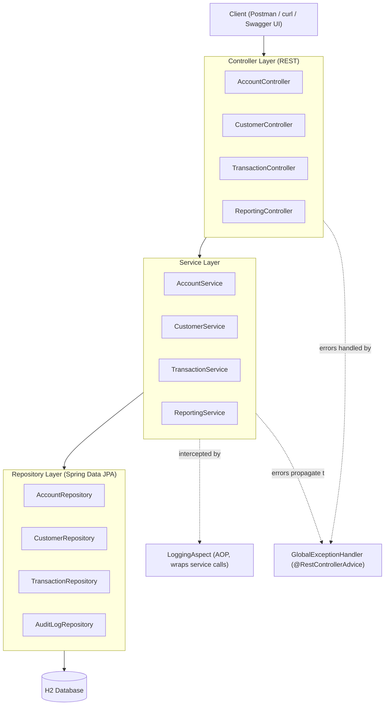
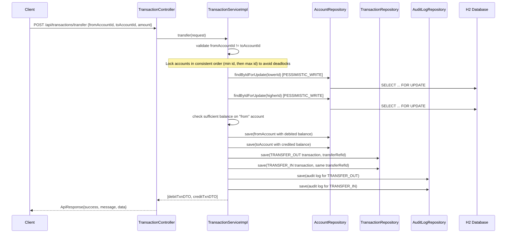

# Architecture & Module Flow

## Layered Architecture

The application follows a standard layered Spring Boot architecture, with a cross-cutting AOP aspect for logging and a centralized handler for exceptions:

## Request Flow Example: Fund Transfer

This is the most involved flow in the system, so it's worth tracing end-to-end:

The entire method is wrapped in `@Transactional`, so if any step fails (e.g. the second account doesn't exist), the whole operation — including the partially-applied balance changes — rolls back.

## Module Responsibilities

| Module | Responsibility |
|---|---|
| `controller` | Translates HTTP requests/responses, delegates to services, wraps results in `ApiResponse<T>` |
| `service_interface` | Defines business contracts, decoupling controllers from implementation details |
| `service_implementation` | Core business rules: balance math, locking strategy, validation, audit logging |
| `repository` | Data access via Spring Data JPA, including custom locking and aggregate queries |
| `entity` | JPA-mapped domain model (Customer, Account, Transaction, AuditLog) and enums |
| `request_dto` / `response_dto` | Decouple the public API contract from the internal entity model |
| `exception` | Domain exception type + centralized translation into HTTP error responses |
| `aspect` | Cross-cutting method-level logging around service execution |

## Concurrency & Data Integrity

- **Pessimistic locking** (`@Lock(LockModeType.PESSIMISTIC_WRITE)` in `AccountRepository.findByIdForUpdate`) ensures only one transaction can read-and-modify a given account's balance at a time, satisfying the "thread-safe fund transfer" non-functional requirement.
- **Consistent lock ordering**: transfers always lock the lower account id first. Without this, two concurrent transfers moving money in opposite directions between the same pair of accounts (A→B and B→A) could each hold one lock and wait for the other, deadlocking. Locking by a fixed order eliminates that.
- **Optimistic locking** (`@Version` on `Account`) is a second layer of protection — if a row is ever updated outside the locked code path, Hibernate detects the version mismatch and fails fast instead of silently overwriting data.
- **ACID transactions**: `deposit`, `withdraw`, and `transfer` are all `@Transactional`, so balance updates, transaction records, and audit log entries either all commit together or all roll back together.

## Module Flow Summary (Functional Requirements → Implementation)

| Functional Requirement | Where it's implemented |
|---|---|
| Create customer, link accounts | `CustomerController`/`CustomerServiceImpl`, `AccountController`/`AccountServiceImpl` (accounts reference `customer_id`) |
| Deposit / withdrawal | `TransactionController.deposit` / `withdraw` → `TransactionServiceImpl` |
| Fund transfer | `TransactionController.transfer` → `TransactionServiceImpl.transfer` |
| Prevent overdraft / invalid transactions | Balance checks in `TransactionServiceImpl` (throws on insufficient balance or same-account transfer) |
| Transaction history per account | `Transaction` entity + `TransactionRepository.findStatement` |
| Account statement API | `ReportingController.getStatement` → `ReportingServiceImpl.getStatement` |
